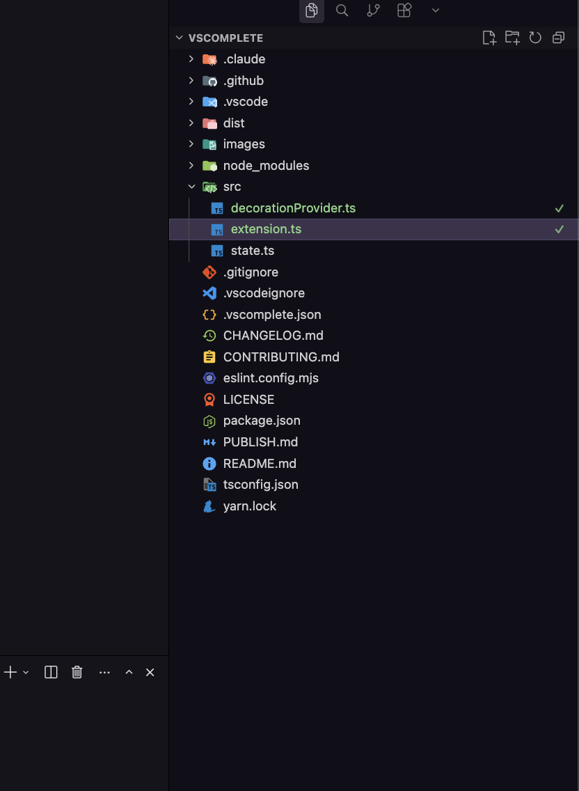
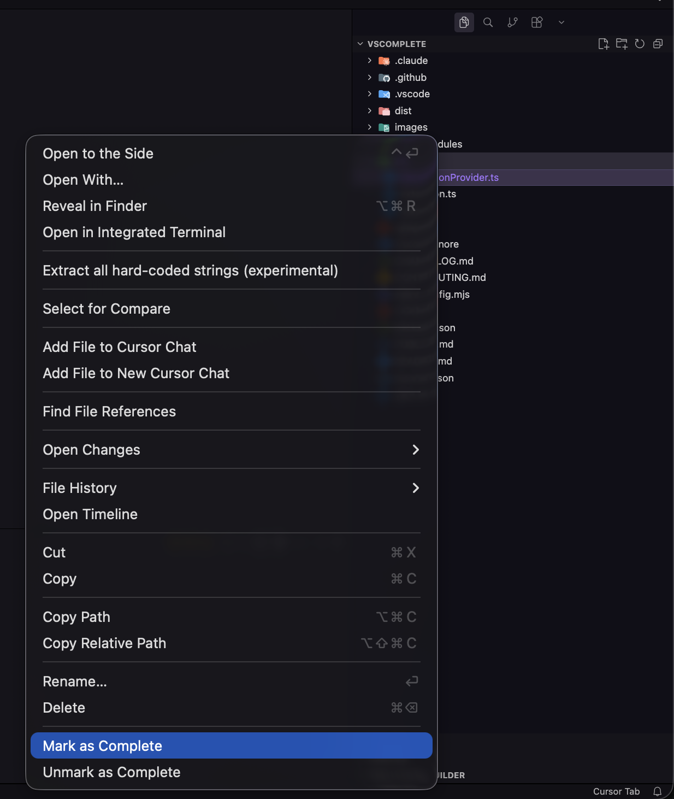

# VSComplete

Visually mark files and folders as complete in the VS Code explorer.

A lightweight extension that adds a green checkmark badge to files and folders you've finished working on — helping you track progress through large codebases, reviews, migrations, or any task that involves working through files one by one.



## Features

- **Mark files as complete** — adds a green ✓ badge in the explorer
- **Mark entire folders** — recursively marks all files within the folder
- **Unmark to revert** — remove completion status when needed
- **Persisted state** — completion data saved to `.vscomplete.json` in your workspace root
- **Customisable colours** — theme colour `vscomplete.completedForeground` can be overridden

## Installation

### VS Code Marketplace

Search for **VSComplete** in the VS Code Extensions panel, or install from the command line:

```sh
code --install-extension jxshco.vscomplete
```

### From Source

```sh
git clone https://github.com/jxshco/vscomplete.git
cd vscomplete
yarn install
yarn compile
```

Then press `F5` in VS Code to launch the Extension Development Host.

## Usage

Right-click any file or folder in the explorer to see:



- **Mark as Complete** — adds the ✓ badge
- **Unmark as Complete** — removes the ✓ badge

Completion state is stored in `.vscomplete.json` at your workspace root. You can commit this file to share progress with your team, or add it to `.gitignore` to keep it local.

## Configuration

### Theme Colour

Override the badge colour in your `settings.json`:

```json
{
  "workbench.colorCustomizations": {
    "vscomplete.completedForeground": "#f59e0b"
  }
}
```

Default colours:
| Theme | Colour |
|-------|--------|
| Dark | `#22c55e` |
| Light | `#16a34a` |
| High Contrast | `#22c55e` |
| High Contrast Light | `#16a34a` |

## The `.vscomplete.json` File

This is a simple JSON array of relative file paths:

```json
[
  "src/extension.ts",
  "src/state.ts"
]
```

Add it to `.gitignore` if you don't want to track it in version control.

## Contributing

See [CONTRIBUTING.md](CONTRIBUTING.md) for development setup and guidelines.

## License

[MIT](LICENSE)
